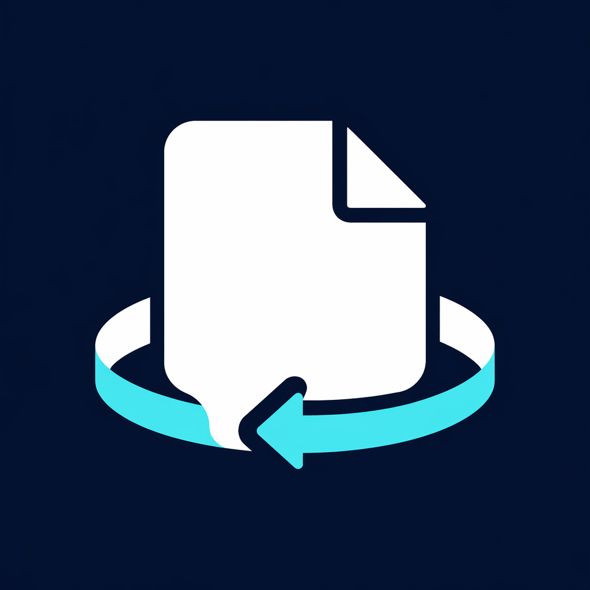

# MemFlywheel

<p align="center">
  
</p>

<p align="center">
  <strong>Agent-native long-term memory that learns after every run</strong><br>
  <span>File-native, auditable, and integrated with Pi, Hermes, OpenCode, and OpenClaw.</span>
</p>

<p align="center">
  <strong>English</strong> | <a href="README.zh.md">简体中文</a>
</p>

<p align="center">
  <a href="https://www.npmjs.com/package/@iflytekopensource/memflywheel"></a>
  <a href="https://www.npmjs.com/package/@iflytekopensource/memflywheel"></a>
  <a href="https://github.com/iflytek/memflywheel/releases"></a>
  <a href="https://github.com/iflytek/memflywheel/actions/workflows/ci.yml"></a>
  
  <a href="LICENSE"></a>
  <a href="https://deepwiki.com/iflytek/memflywheel"></a>
</p>


MemFlywheel is an open-source, file-native long-term memory layer for AI agents.
It helps an agent recall useful context before a task, extract durable knowledge
after the task, consolidate memory while idle, and turn repeated workflows into
reusable skills—without hiding the result in an opaque database.

> **Already using an agent harness?** Install one npm package, connect
> MemFlywheel as the host's native memory plugin, and keep your existing models,
> credentials, tools, permissions, and sessions.

## Why MemFlywheel?

Most AI agents begin every run with limited context. MemFlywheel creates a
continuous learning loop while keeping developers in control:

| Capability               | What it gives you                                                                                      |
| ------------------------ | ------------------------------------------------------------------------------------------------------ |
| **File-native memory**   | Markdown memories, YAML metadata, source traces, and learned skills that are inspectable and diffable. |
| **Progressive recall**   | Lightweight index cues first, followed by relevant memory bodies, evidence, and skills.                |
| **Post-run learning**    | Durable extraction at turn end plus dream consolidation and repair during idle time.                   |
| **Reusable skills**      | Repeated successful workflows can evolve into explicit skills the agent can inspect and reuse.         |
| **Harness-native setup** | One public npm package for Pi, Hermes, OpenCode, and OpenClaw.                                         |
| **Model-agnostic core**  | The host retains model access and credentials; MemFlywheel owns only the memory-and-learning loop.     |

MemFlywheel is designed for teams that want persistent agent memory with an
auditable storage model—not a new agent framework, model service, or vector
database.

## How It Works

```text
Agent Harness
   |
   |  lifecycle / model / auth / tools
   v
MemFlywheel
   |
   |-- pre-recall       -> MEMORY.md index cues
   |-- progressive read -> memory bodies -> source traces -> learned skills
   |-- turn-end         -> durable memory extraction
   |-- idle             -> dream consolidation and repair
   `-- repeated work    -> reusable learned skills
```

<table>
  <tr>
    <td width="50%"></td>
    <td width="50%"></td>
  </tr>
  <tr>
    <td><strong>Memory lifecycle</strong><br>Recall, extract, consolidate, and keep evidence close to the file-native store.</td>
    <td><strong>Skill flywheel</strong><br>Repeated work evolves into reusable learned skills the agent can inspect and reuse.</td>
  </tr>
</table>

## Supported Agent Harnesses

| Host         | Integration path                                                |
| ------------ | --------------------------------------------------------------- |
| **Pi**       | Native Pi package                                               |
| **Hermes**   | MemoryProvider installer and skill mirror                       |
| **OpenCode** | Global plugin                                                   |
| **OpenClaw** | Memory-slot plugin with conversation and prompt-injection hooks |

See the complete setup, verification commands, and troubleshooting guide in
[`docs/integrations.md`](docs/integrations.md).

## Quick Start

**Requirements:** Node.js 22.19 or later and a supported agent harness.

<details open>
<summary><strong>Pi</strong></summary>

```sh
pi install npm:@iflytekopensource/memflywheel
```

</details>

<details>
<summary><strong>Hermes</strong></summary>

```sh
npm install -g @iflytekopensource/memflywheel
memflywheel-hermes-install
hermes config set memory.provider memflywheel
```

</details>

<details>
<summary><strong>OpenCode</strong></summary>

```sh
opencode plugin @iflytekopensource/memflywheel --global
opencode run --dir /path/to/project "your task"
```

</details>

<details>
<summary><strong>OpenClaw</strong></summary>

```sh
openclaw plugins install npm:@iflytekopensource/memflywheel
openclaw config set plugins.slots.memory memflywheel
openclaw config set plugins.entries.memflywheel.hooks.allowConversationAccess true
openclaw config set plugins.entries.memflywheel.hooks.allowPromptInjection true
openclaw gateway run --force
```

</details>

MemFlywheel installs into each host as a native memory plugin. The host keeps
owning models, tools, permissions, and sessions; MemFlywheel adds recall,
turn-end extraction, dream consolidation, and learned skills.

### Optional embedding pre-recall

MemFlywheel works without an embedding service and can inject up to 200
generated `MEMORY.md` index lines directly. For larger memory indexes, start any
OpenAI-compatible embeddings endpoint and export these variables before starting
the host. MemFlywheel then injects only the most relevant index entries.

```sh
export MEMFLYWHEEL_EMBEDDING_ENDPOINT="https://embedding-gateway.example.com/v1"
export MEMFLYWHEEL_EMBEDDING_API_KEY="..."
export MEMFLYWHEEL_EMBEDDING_MODEL="text-embedding-3-small"
```

## Package

| Package                                                                                          | Role                                                                                                            |
| ------------------------------------------------------------------------------------------------ | --------------------------------------------------------------------------------------------------------------- |
| [`@iflytekopensource/memflywheel`](https://www.npmjs.com/package/@iflytekopensource/memflywheel) | Pi, Hermes, OpenCode, and OpenClaw integrations, including the Hermes MemoryProvider installer and skill mirror |

Internal workspace packages keep the code split by responsibility; users install
the same public package for every supported host.

## Architecture and Evaluation

MemFlywheel keeps memory as Markdown with YAML frontmatter and treats
`MEMORY.md` as a rebuildable index. The core stays independent of direct model
calls; host-resolved model bindings run extraction and other write-side tasks.
Read the full [architecture](docs/architecture.md) for storage and package
boundaries.

LoCoMo-oriented regression checks keep long-term-memory behavior measurable as
recall, extraction, consolidation, and learned-skill loops evolve. See the
[evaluation guide](docs/evaluation.md).

## Documentation

| Document                                                           | Content                                                                           |
| ------------------------------------------------------------------ | --------------------------------------------------------------------------------- |
| [`docs/architecture.md`](docs/architecture.md)                     | Storage layout, recall, extraction, dream, skill loop, package boundaries         |
| [`docs/integrations.md`](docs/integrations.md)                     | Pi, Hermes, OpenCode, OpenClaw, embedding pre-recall, SDK hooks, adapter boundary |
| [`docs/comparison.md`](docs/comparison.md)                         | What changes vs host-native memory, runtime overhead, when to use which           |
| [`docs/evaluation.md`](docs/evaluation.md)                         | LoCoMo position and local regression checks                                       |
| [`docs/release.md`](docs/release.md)                               | Versioning, npm release channel, publish checklist                                |
| [Project website](https://iflytek.github.io/memflywheel/)          | Search-friendly overview, quick start, and contribution paths                     |
| [`CHANGELOG.md`](CHANGELOG.md)                                     | Release notes for public npm package versions                                     |
| [`NOTICE`](NOTICE), [`THIRD_PARTY_LICENSES`](THIRD_PARTY_LICENSES) | Project notice and third-party license disclosure                                 |

## Contributing

Developer collaboration is welcome—whether you want to improve a host
integration, memory lifecycle behavior, documentation, tests, or developer
experience.

- Read the [contribution guide](CONTRIBUTING.md) to set up the workspace and
  understand the project's design boundaries.
- Browse [good first issues](https://github.com/iflytek/memflywheel/issues?q=is%3Aissue%20is%3Aopen%20label%3A%22good%20first%20issue%22)
  or [help wanted issues](https://github.com/iflytek/memflywheel/issues?q=is%3Aissue%20is%3Aopen%20label%3A%22help%20wanted%22).
- [Report a bug](https://github.com/iflytek/memflywheel/issues/new?template=bug_report.md),
  [request a feature](https://github.com/iflytek/memflywheel/issues/new?template=feature_request.md),
  or open a [general issue](https://github.com/iflytek/memflywheel/issues/new/choose).
- Review an [open pull request](https://github.com/iflytek/memflywheel/pulls)
  and share focused, reproducible feedback.

Please run `pnpm run ci` before opening a pull request. All participation is
covered by the [Code of Conduct](CODE_OF_CONDUCT.md).

## Project Scope

MemFlywheel is a foundation component inside an Agent Harness. It stays
file-native, model-agnostic, and host-first; it does not absorb the main agent,
model service, tool permissions, or skill execution into itself.

## Community and Support

- Use [GitHub Issues](https://github.com/iflytek/memflywheel/issues) for public
  questions, bug reports, and feature requests.
- Read [`SUPPORT.md`](SUPPORT.md) before sharing logs or memory samples.
- Join the Astron Open Source Community (WeCom Group) to discuss and collaborate:


## License

MemFlywheel is licensed under the [Apache License 2.0](LICENSE).
